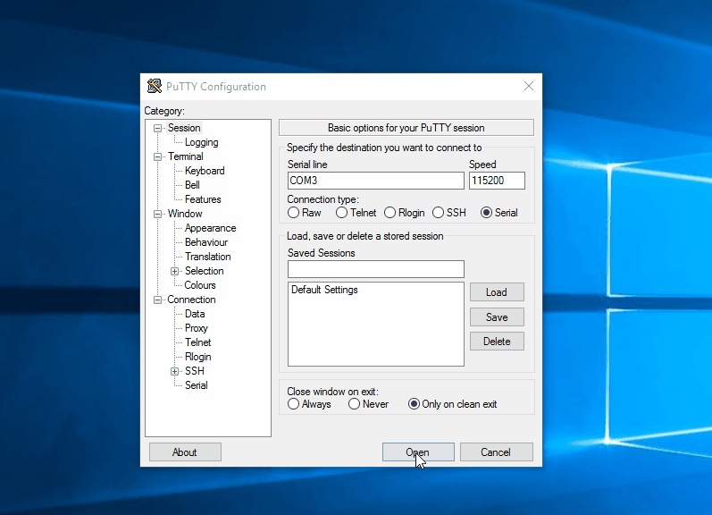

# Tiva_REPL
Read-Evaluate-Print Loop program for TI Tiva Launchpad.

This project was designed to serve as a simple human-machine interface for the Texas Instrument EK-TM4C123GXL development kit (aka Tiva Launchpad). The virtual serial port (UART) connection is provided by the In-Circuit Debug Interface (ICDI), which connects the board to the USB port in the development machine.

### 1 - How to Use It

Flash the board with "Tiva_REPL.bin" file using LM Flash Programmer (Windows) or lm4flash (Linux). Find the number of the COM port provided by the ICDI device. 

With Windows, you can use Putty and connect with the board through the serial connection option, COM<x> (where <x> stands for the port's number of the board in your system), speed = 115200 bps.

The current version provides the following commands:

i) **clear** -> Clears the screen.

ii) **help** -> Shows help menu.

iii) **clock** -> returns core's clock (in Hz).

iv) **temp** -> returns core temperature measured by the internal sensor of the microcontroller (in Celsius degrees).

#### 1.1 - Example Usage

### 2 - Constraints

This project was developed with the following tools:

i) **Eclipse IDE**

ii) **openocd-0.8.0**

iii) **SW-TM4C Tivaware for C Series Software (version 2.1.4.178)**
